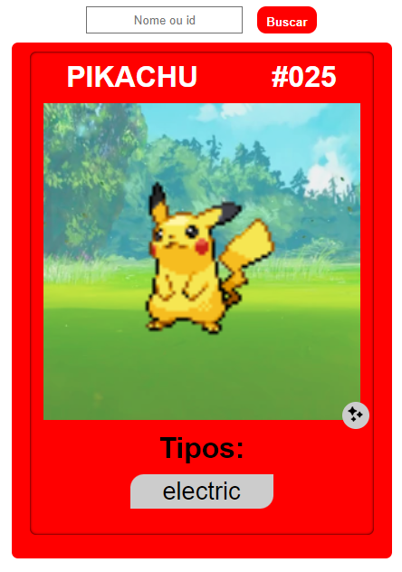

# pokeApi

    
     
    <a href="https://moreiramatheus.github.io/pokeApi/">
        
        Clique aqui para ver o projeto na web
        
    </a>

Projeto criado para praticar o consumo de API com JavaScript, a API escolhida foi a [PokeAPI](https://pokeapi.co) que como o próprio nome já sugere é uma API com dados de pokemons

## Projeto desenvolvido utilizando:
* HTML
* CSS
* JS
